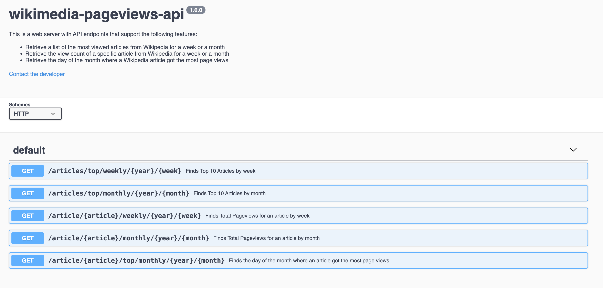

# wikimedia-pageviews-api

A Go web server with API endpoints that support the following features:

- Retrieve a list of the most viewed articles from Wikipedia for a week or a month
- Retrieve the view count of a specific article from Wikipedia for a week or a month
- Retrieve the day of the month where a Wikipedia article got the most page views

The web servier is using the [Wikipedia API](https://wikitech.wikimedia.org/wiki/Analytics/AQS/Pageviews) to retrieve the info.

## Run the API

```shell
docker build -t wikimedia-pageviews-api .
docker run --publish 8080:8080 wikimedia-pageviews-api
```

Send requests to `http://localhost:8080`.

## Run the Tests

```shell
docker run --publish 8080:8080 wikimedia-pageviews-api sh -c "go test ./..."
```

With coverage info:

```shell
docker run --publish 8080:8080 wikimedia-pageviews-api sh -c "go test ./... -coverprofile=c.out ./.."
```

## Other Commands

If you have [Taskfile](https://taskfile.dev/) and/or [Go](https://go.dev/doc/install) installed locally, you can use the following commands instead of Docker:

- list available tasks: `task --list`
- startup server: `task run` or `go run internal/main.go`
- generate executable binary: `task build` or `go build -o bin/wikimedia-pageviews-api internal/main.go`
- run tests: `task test` or `go test ./...`
- see tests coverage: `task test.coverage` or `go test -coverprofile=c.out ./...`
- generate updated docs: `task swagger.doc` or `docker run -i yousan/swagger-yaml-to-html < pkg/swagger/swagger.yml > docs/index.html`

## API Documentation

- [Swagger docs](docs/index.html)

  

## Call the API

- Using cURL:

  ```shell
  curl http://localhost:8080/articles/top/monthly/YYYY/MM
  curl http://localhost:8080/articles/top/weekly/YYYY/WW
  curl http://localhost:8080/article/ARTICLE/weekly/YYYY/WW
  curl http://localhost:8080/article/ARTICLE/monthly/YYYY/MM
  curl http://localhost:8080/article/ARTICLE/top/monthly/YYYY/MM
  ```

  Where:

  - YYYY: year
  - WW: week
  - MM: month
  - ARTICLE: article name

- Using Postman: [collection](docs/wikipedia-pageviews-api.postman_collection.json)

## Assumptions

- The endpoints that return the top articles for a week and a month return only the top 10 (instead of the 1000 that the Wikipedia provides). This was done for convinience since it's easier to do manual tests with smaller result sets.
- There are 2 endpoints that require as input the year and the week for which the user wants data. The week input corresponds to the week number. So for example if the input is `2023/02` the API will serve data for the 2nd week of 2023 which is January 9, 2023 to January 15, 2023. Edge cases have been taken into consideration, so for example the dates for `2022/52` are December 26, 2022 to January 1, 2023, while for `2020/01` the dates are December 30, 2019 to January 5, 2020.
- The start of the week is assumed to be Monday (see Future Improvements for more).
- When the server make calls to the Wikipedia API it considers anything different than HTTP 200 a failure, even though all 2xx codes are considered successful according to the IETF HTTP spec. This is done for simplicity reasons in the exercise context and it wouldn't be done in a real world scenario.
- The API retrieves data only from `en.wikipedia`.

## Future Improvements and Next Steps

- Parallelize calls: the endpoint that returns the top articles for a given week has a loop that makes 7 calls to the Wikipedia API, one for each day of the week. This could be parallelized to improve performance.
- Use HTTPS. Currently the API uses HTTP but in a real world scenario we would encrypt the communication using SSL/TLS.
- Add healthcheck endpoint.
- Improve test coverage for various error cases.
- Improve input validation. The API validates that the input for year, month, or week is numeric and that the number is within bounds for year and week, but it does not validate the month. As a result calls with month > 12 will error out after the server calls the Wikipedia API. It's best to validate input at the beginning, before any calls are made to the Wikipedia API.
- Improve the regular expressions that match the URL called with the route. The one validating the article name works for most wikipedia articles, but fails for some cases with special characters. For example, if you call try to get the pageviews for the article `https://en.wikipedia.org/wiki/Æthelred_the_Unready` you will get a 404 as the regular expression cannot match the request to a route. However, if you URL-encode the input it will work: `http://localhost:8080/article/%25C3%2586thelred_the_Unready/weekly/2023/03`. This mostly happens with Extended ASCII characters. URLs like `http://localhost:8080/article/Davy's_on_the_Road_Again/weekly/2023/03` or `http://localhost:8080/article/C_(programming_language)/monthly/2023/10` will work.
- Currently the API works only for `en.wikipedia`. A future improvement could be to make this part of the request input so the API can support all available languages.
- Documentation: move documentation in the code by adding swagger comments and be able to generate updated documentation. Use [go-swagger](https://github.com/go-swagger/go-swagger) to do that.
- Improve error responses: currently when an error occurs the API returns a JSON doc containing one `Error` string. Refactor this to include more info properly structured. For example:
  ```json
  {
    "status": 400,
    "message": "detailed error",
    "more_info": "http://www.mydomain.com/link/to/error/docs"
  }
  ```
- Logging: currently the API simply logs in the console whenever an error occurs.
- Mocking: currently the API tests are making calls to the wikipedia API. We can moke the API and test against the expected results.
- Configuration file: move values like the wikipedia base URL, port number, etc in a configuration file.
- Make the start of the week part of the API input. It could be Monday, Sunday, or Saturday (if the API was available to the Middle East or North Africa).
- The Wikipedia API has some rules that were not taken into consideration or the scope of this exercise (e.g. headers to set).
- API versioning.
- There are more small improvements noted throughtout the codebase using `// Enhancement:`.
